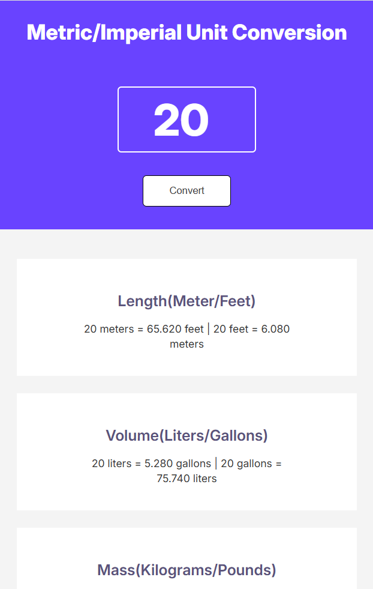

# 📏Unit-converter app

Unit converter while using these measurements raports: 
- 1 meter = 3.281 feet
- 1 liter = 0.264 gallon
- 1 kilogram = 2.204 pound

## 🛠️Tech Stack

  

## ⚙️How it works?

Introduce the number you want to covert in the empty field and click "Convert", it will automatically convert all 3 raports at once.

## 🖻SS

## 🔛Live link

Vezi aplicatia live aici: 
[GitPages](https://isabelamihai.github.io/unit-converter/)  
[Netlify](https://unit-converter-mini.netlify.app/)
